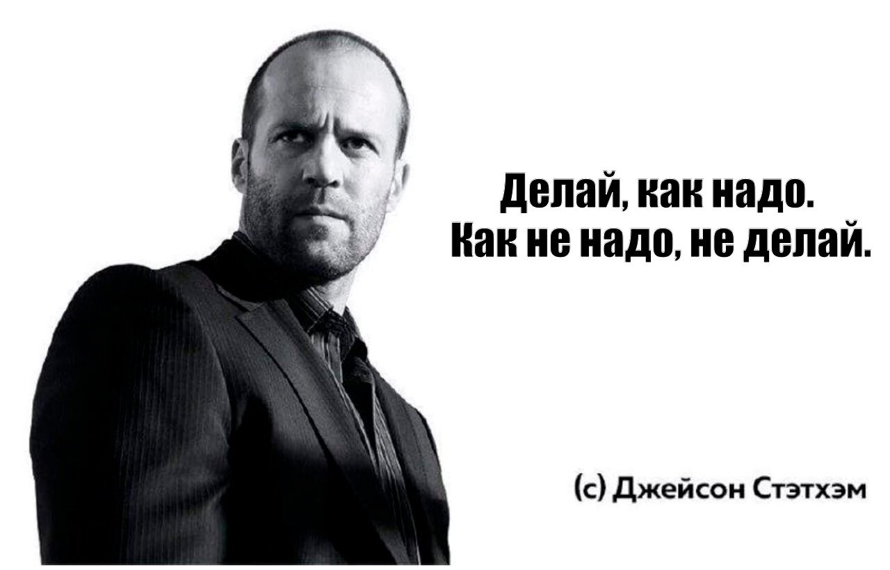

# Лабораторная работа № 1 
**ФИО**: Попов Игорь Станиславович

**Группа**: 6403

**Научный руководитель**: Попов Сергей Борисович

**Тема дипломной работы**: Применение графовых нейронных сетей в анализе изображений

**Любимая цитата Джейсона Стетхема**: "*Делай, как надо. Как не надо, не делай.*"

